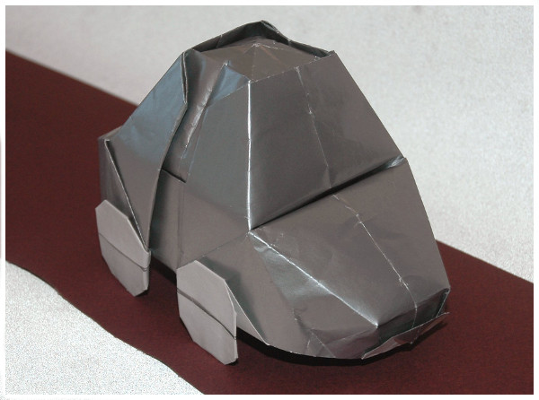
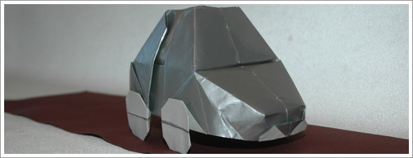

O famoso Carocha (em Portugal) ou Fusca (no Brasil). É um modelo já complexo, mas o diagrama é fácil de seguir. Aconselho a usar um papel metalizado mas com cor diferente no verso para dar o efeito de carro.

[O diagrama está disponivel aqui](../img/carocha.pdf)