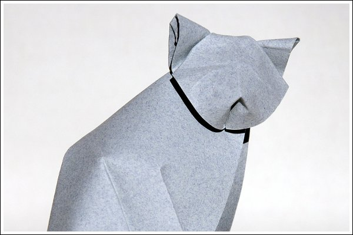

Um gato sentado de resultado muito giro. É um modelo já um bocado exigente. Não por ter dobras muito complexas, mas porque requer que se domine a tridimensionalidade. Por outras palavras, para este modelo resultar têm de se fazer dobras mais vincadas que outras. Por exemplo, o papel tem de ficar "arqueado" no lombo do gato e no rabo. Resulta melhor se dobrarmos este modelo no ar para sentirmos o modelo a ganhar "profundidade" e "dimensão".

[O diagrama está disponivel aqui](../pdf/cat.pdf)

Precisa de instalar o [adobe acrobat reader](http://get.adobe.com/br/reader/) (ou outro leitor de ficheiros pdf) para ver o diagrama.