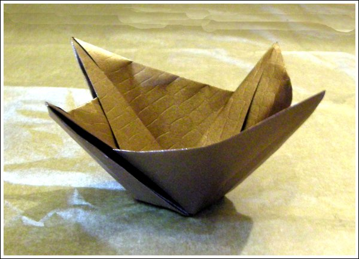

Era preciso uma taça para servir uns biscoitos. Ok, mãos à obra.

Encontrei este modelo que serve para servir biscoitos, bolachas, bombons.

Eu gosto muito destes modelos que têm muitas dobras prévias, em que parece que estamos apenas a amarrotar papel. Mas quando no fim tudo encaixa e surge um objecto resistente é uma surpresa agradável.

[O diagrama está disponivel aqui](/img/taca_dia.pdf)

Ok, ok, quer saber onde está o diagrama para fazer aquele laçarote em papel que se vê no frasco com biscoitos?

O diagrama para o laço pode encontrar [aqui](/img/taca_laco_dia.pdf)