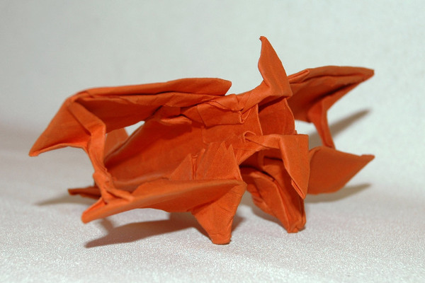
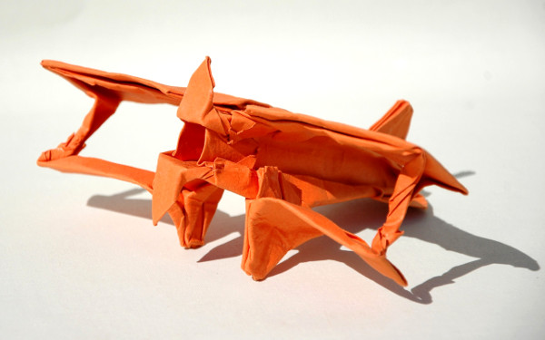

Modelo de Robert Lang dobrado a partir de diagrama no livro [The Complete Book of Origami.](https://www.amazon.co.uk/Complete-Book-Origami-Step-Step-ebook/dp/B00EA7DB3C/ref=as_li_ss_tl?s=books&ie=UTF8&qid=1522479447&sr=1-1&linkCode=ll1&tag=dobrarpapel-21&linkId=c1ad3d168d4e186ad886bd41825c65a5){:target="_blank"}

O modelo da imagem abaixo foi feito a partir de um quadrado de papel Canson recorrendo à técnica de wet folding.

