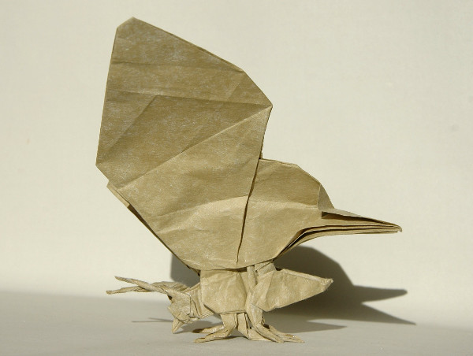

Modelo de Peter Engel. O diagrama deste modelo pode ser encontrado no livro [Origami from Angelfish to Zen.](https://www.amazon.co.uk/Origami-Angelfish-Zen-Dover-Papercraft/dp/0486281388/ref=as_li_ss_tl?ie=UTF8&linkCode=ll1&tag=dobrarpapel-21&linkId=6adf766154ac24b64451a38fdf812417){:target="_blank"}

O modelo da imagem abaixo foi dobrado a partir de um quadrado de papel foil.

