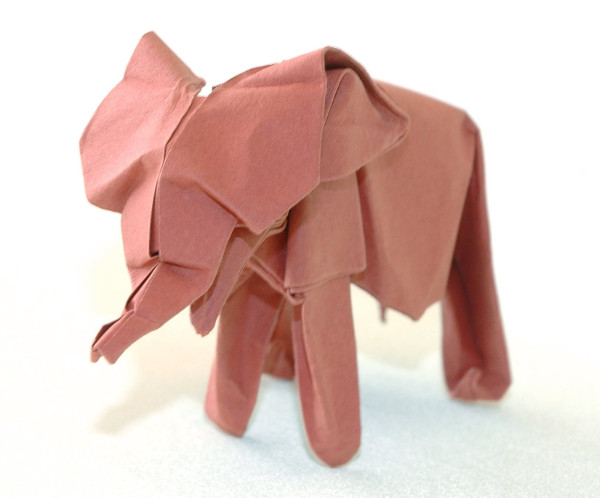
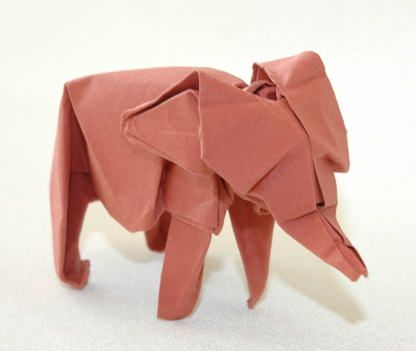

Este é o modelo que dá o logotipo deste site. É um modelo que eu gosto muito pelo resultado muito real que transfere. Autoria do modelo é de David Brill. O diagrama deste modelo pode ser encontrado no livro [Brilliant Origami.](https://www.amazon.co.uk/Brilliant-Origami-Collection-Original-Designs/dp/0870408968/ref=as_li_ss_tl?s=books&ie=UTF8&qid=1522480701&sr=1-10&keywords=david+brill&linkCode=ll1&tag=dobrarpapel-21&linkId=d81e37feab0fd392f8df746ba484c69e){:target="_blank"}

O diagrama da imagem abaixo foi dobrado a partir de um quadrado de papel Canson recorrendo à técnica de wet folding.

