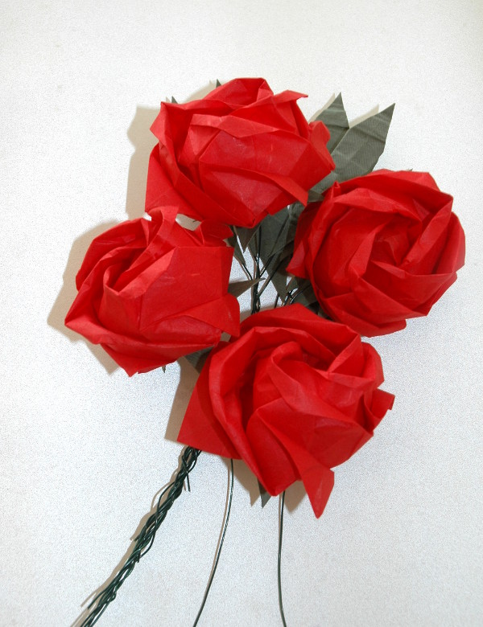
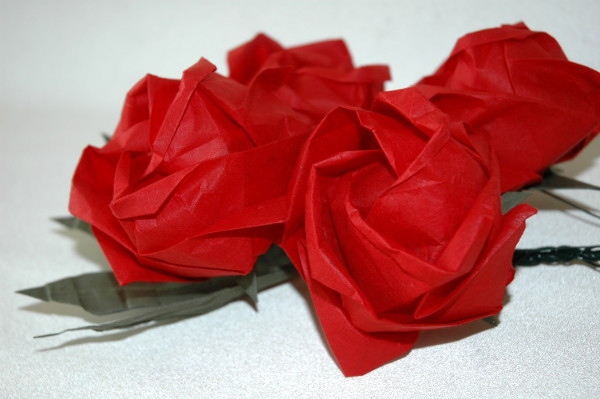

Modelo de Toshikazu Kawasaki. Pode encontrar como dobrar este modelo noutro [post deste site]({{ site.baseurl }}). Mas este modelo tem mais detalhe e por isso um pouco mais dificil de dobrar.

Os modelos das imagens abaixo foram dobrados a partir de um quadrado de papel Unryu. Sépalas a partir de um quadrado de papel kraft. Foram usados arames de jardineiro para compor o conjunto.

[O diagrama está disponivel aqui](../img/rose.pdf)