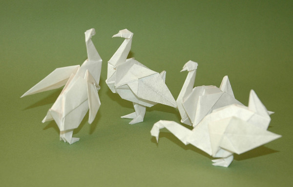

Modelo de John Montroll. O diagrama para este modelo pode ser encontrado no livro [Origami for the Connoisseur.](https://www.amazon.co.uk/Origami-Connoisseur-Kunihiko-Kasahara/dp/4817090022/ref=as_li_ss_tl?s=books&ie=UTF8&qid=1522503101&sr=1-1&keywords=origami+for+the+connoisseur&linkCode=ll1&tag=dobrarpapel-21&linkId=e37503fde9de892685806dbc22d06898){:target="_blank"} 

Os modelos da imagem abaixo foram dobrados a partir (cada um) de um quadrado de papel vegetal.

