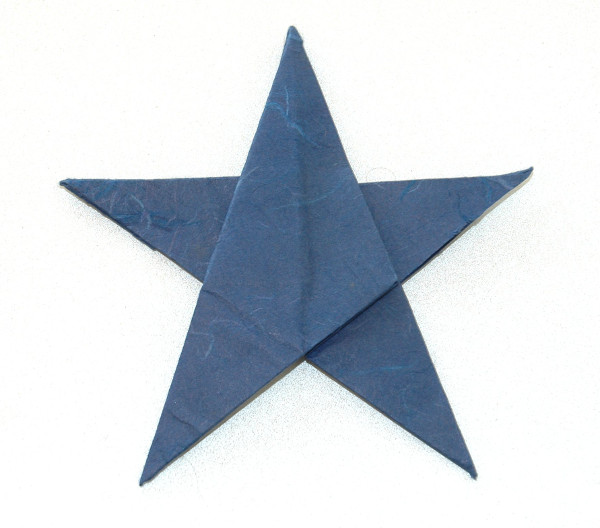

Modelo de Robert Lang. O diagrama para este modelo pode ser encontrado no livro [Origami Sea Life.](https://www.amazon.co.uk/Origami-Sea-Life-John-Montroll/dp/1490558950/ref=as_li_ss_tl?ie=UTF8&linkCode=ll1&tag=dobrarpapel-21&linkId=3f823f3dddb7b322e90be8ce56bd99da){:target="_blank"}

Ainda que seja um modelo que Robert Lang desenhou para imitar uma estrela do mar, eu tenho usado este modelo para enfeitar, por exemplo, a árvore de Natal. Daí se encontrar na categoria de "objectos".

O modelo da imagem abaixo foi dobrado a partir de um quadrado de papel colorido.

