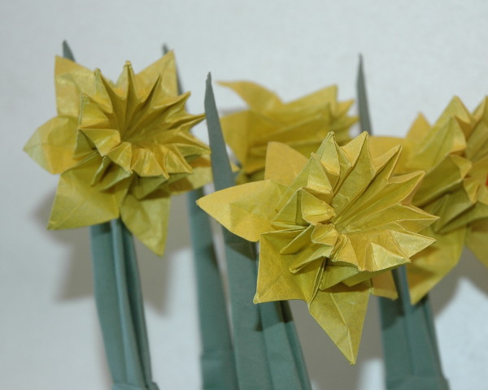
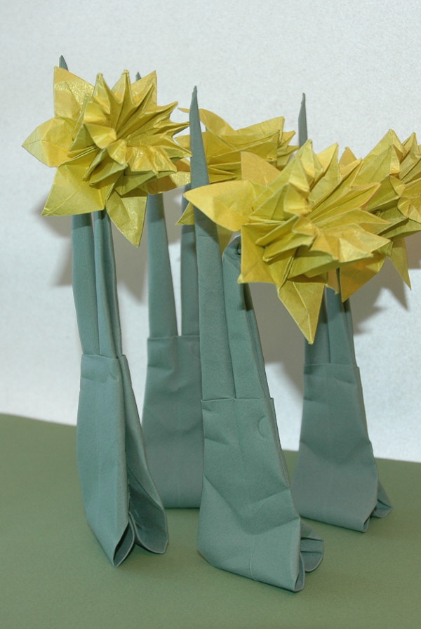

Este é talvez um dos modelos que se pode tentar após dominar os modelos básicos. Mas não se iluda porque não é fácil de dobrar. Aconselho só após dominar bem a "dobra de afundar". Esse tipo de dobra é necessária para fazer este modelo e, na minha opinião, é a etapa mais complicada. Mas o resultado é muito bonito! Perdi a conta a quantos narcisos já dobrei.

 

