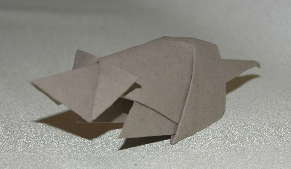
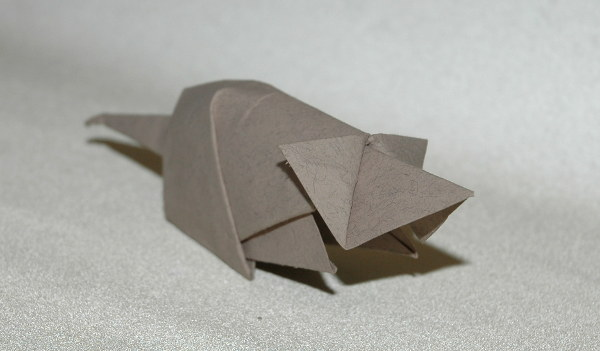

Modelo de David Brill. O diagrama deste modelo pode ser encontrado no livro [Brilliant Origami.](https://www.amazon.co.uk/Brilliant-Origami-Collection-Original-Designs/dp/0870408968/ref=as_li_ss_tl?s=books&ie=UTF8&qid=1522480701&sr=1-10&keywords=david+brill&linkCode=ll1&tag=dobrarpapel-21&linkId=d81e37feab0fd392f8df746ba484c69e){:target="_blank"}

Um modelo simples de dobrar e com um resultado bonito. Um daqueles modelos que apesar de simples o resultado quase parece real.

O modelo da imagem abaixo foi dobrado a partir de um quadrado de papel Fabriano recorrendo à técnica de wet folding. Obviamente para dobrar um modelo tão simples quanto este não é necessário nem papel especial nem técnicas especiais. Mas neste caso o facto de ser dobrado com papel molhado dá mais durabilidade ao modelo.

Pode encontrar como se dobra este modelo no Youtube.

