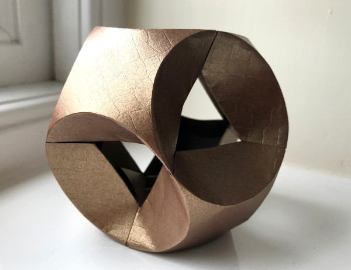

Mas que modelo interessante! Não são muito fã dos origamis modelares porque acho mais desafiante chegar à mesma forma recorrendo apenas a uma folha de papel do que utilizando várias folhas. Porém, não é ocaso para algumas formas geométricas, em que só é possivel dobrá-las recorrendo a várias peças que encaixam. É caso deste modelo. Um resultado muito bonito e equilibrado!  

Pode encontrar como dobrar este modelo no Youtube.